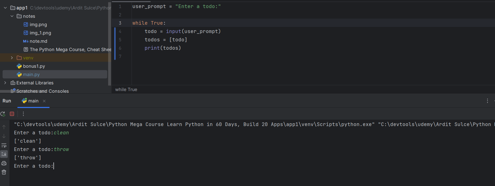
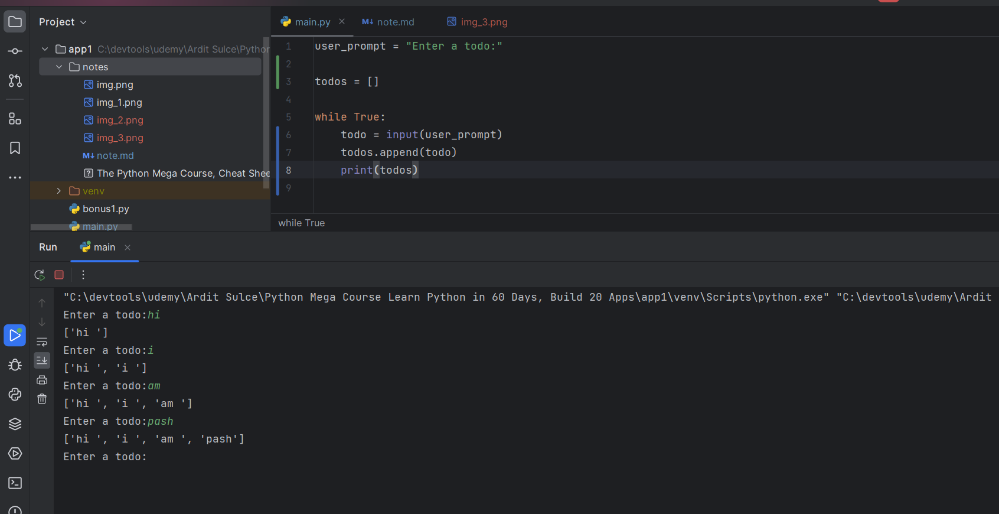
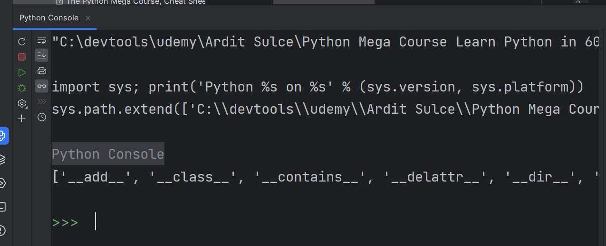

Single quotes vs double quotes
```python
# when to use single quotes vs double quotes ?
# single quotes are used for strings that contain double quotes
# double quotes are used for strings that contain single quotes
# triple quotes are used for strings that contain both single and double quotes

# example of single quotes
print('I said, "Hello" to you.')
# example of double quotes
print("I said, 'Hello' to you.")
# example of triple quotes
print('''I said, "Hello" to you.''')
print("""I said, 'Hello' to you.""")
print('''I said, "Hello" to you.''')

#  which is better to use single quotes or double quotes ?
# it doesn't matter, just be consistent
# if you use single quotes, then you don't have to escape double quotes
```
Python console: used for throw away code, testing code, and debugging code


##### CHEAT CODE PYTHON
[The Python Mega Course, Cheat Sheets.pdf](The%20Python%20Mega%20Course%2C%20Cheat%20Sheets.pdf)

While loop




list problem 


why use list append instead of list add?



```python
# capitalize vs title
# capitalize: first letter of the string
# title: first letter of each word in the string
#
# "hello world".capitalize()  # "Hello world"
# "hello world".title()  # "Hello World"
# "hello world".upper()  # "HELLO WORLD"
# "HELLO WORLD".lower()  # "hello world"

```

How to find the code you need 



You can use python console to find the code you need
use dir(str) to find all the methods of a string

help(str.upper) to find the documentation of a method

help(list.append) to find the documentation of a method
more info: https://docs.python.org/3/library/stdtypes.html#string-methods


import builtins
dir(builtins) to find all the built-in functions
