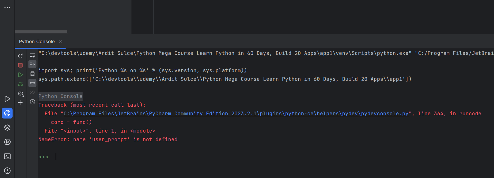
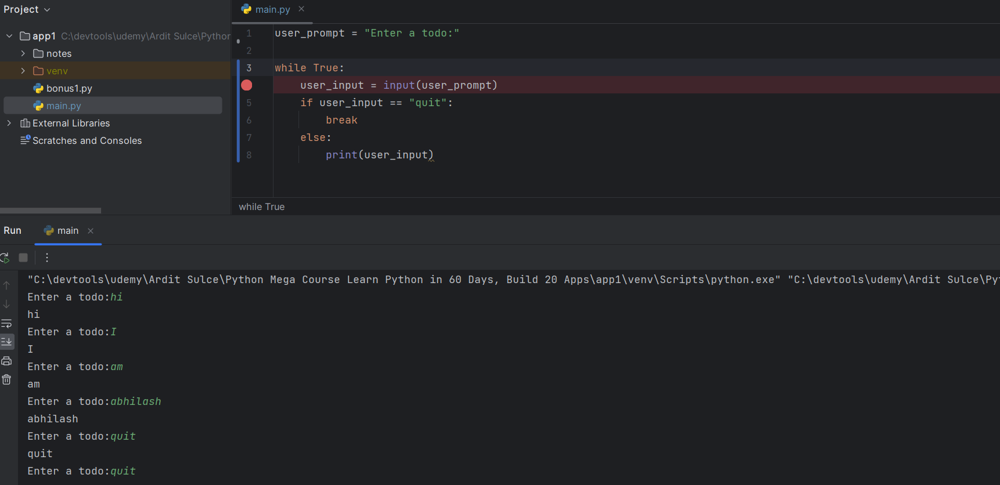

Single quotes vs double quotes
```python
# when to use single quotes vs double quotes ?
# single quotes are used for strings that contain double quotes
# double quotes are used for strings that contain single quotes
# triple quotes are used for strings that contain both single and double quotes

# example of single quotes
print('I said, "Hello" to you.')
# example of double quotes
print("I said, 'Hello' to you.")
# example of triple quotes
print('''I said, "Hello" to you.''')
print("""I said, 'Hello' to you.""")
print('''I said, "Hello" to you.''')

#  which is better to use single quotes or double quotes ?
# it doesn't matter, just be consistent
# if you use single quotes, then you don't have to escape double quotes
```
Python console: used for throw away code, testing code, and debugging code



##### CHEAT CODE PYTHON
[The Python Mega Course, Cheat Sheets.pdf](The%20Python%20Mega%20Course%2C%20Cheat%20Sheets.pdf)

While loop

